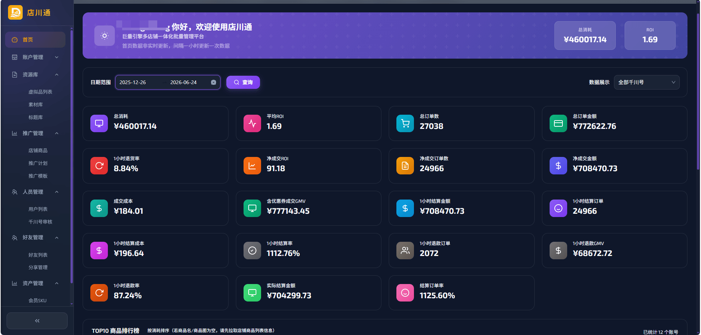
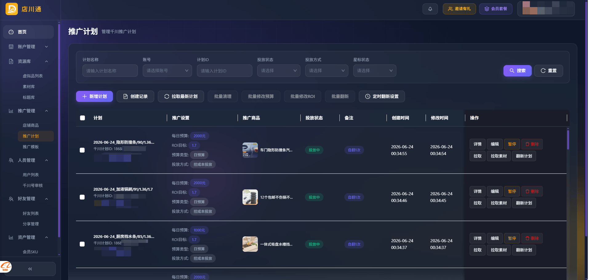
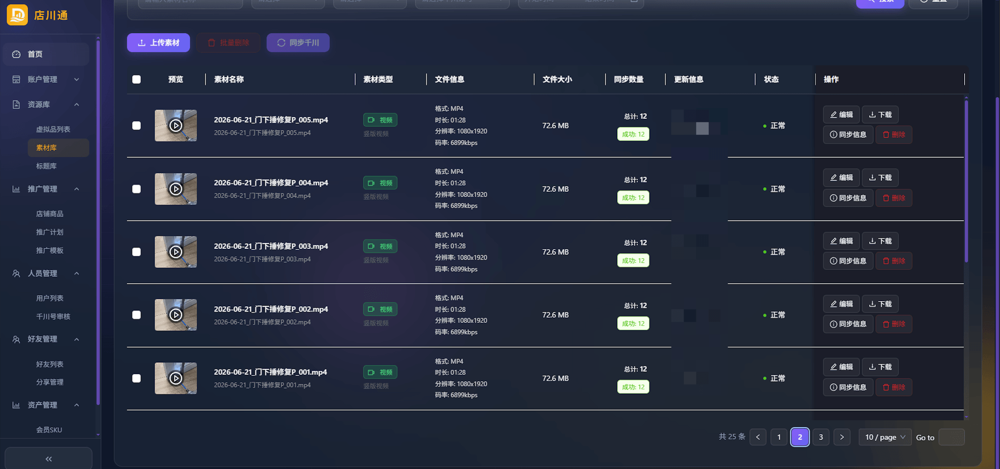
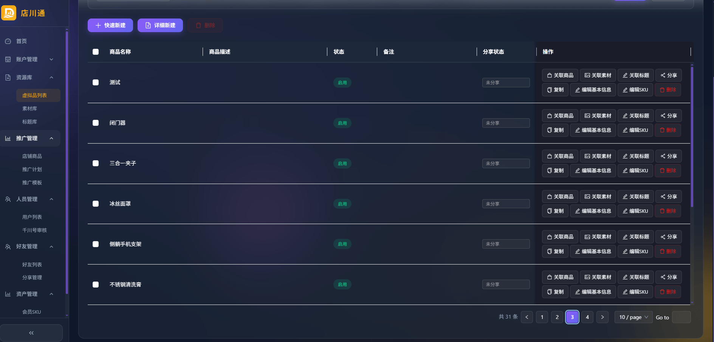
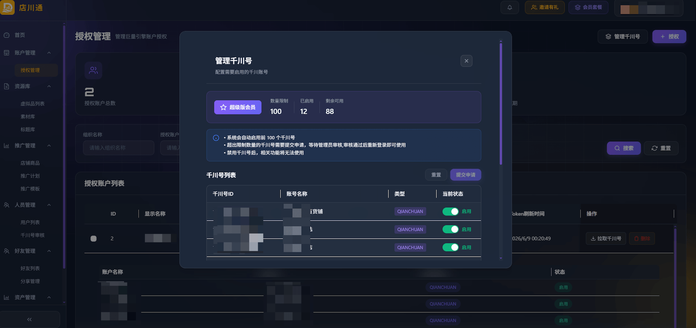
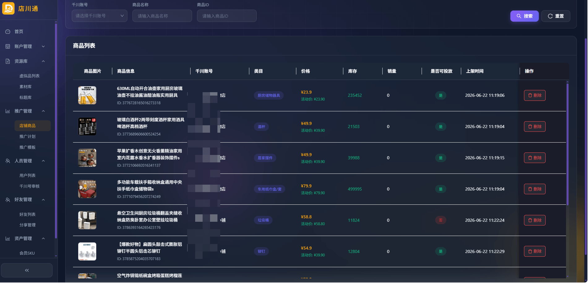
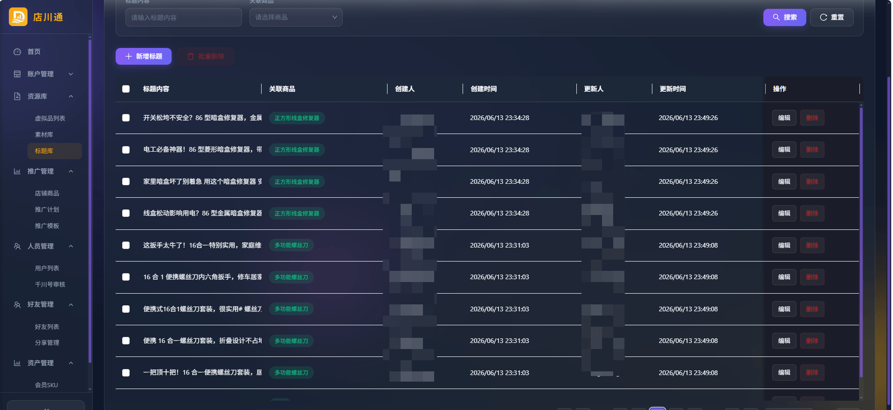

# 店川通 - 巨量引擎千川多店批量管理系统

  

  <strong>专为千川广告主打造的多账户管理工具，推广计划自动翻新，批量操作效率提升10倍</strong>

  <a href="https://dct.bemcss.com" target="_blank">在线体验</a> •
  <a href="#核心功能">功能特性</a> •
  <a href="#产品展示">产品截图</a> •
  <a href="#定价方案">定价方案</a> •
  <a href="#常见问题">常见问题</a>

---

## 目录

- [项目简介](#项目简介)
- [核心功能](#核心功能)
- [产品展示](#产品展示)
- [产品优势](#产品优势)
- [定价方案](#定价方案)
- [快速开始](#快速开始)
- [常见问题](#常见问题)
- [联系我们](#联系我们)

---

## 项目简介

**店川通**是一款专为[巨量引擎千川](https://ad.oceanengine.com)广告主设计的多店批量管理系统。无论是管理单个店铺还是同时运营上百个千川账户，店川通都能帮助您实现推广计划的自动翻新、预算与ROI的批量调整、素材的统一管理，以及多账户数据的实时汇总。

通过 **OAuth2.0 安全授权**绑定千川账户，无需密码即可管理，让您的广告投放更高效、更安全。

> **关键词**: 千川管理, 巨量引擎, 多账户管理, 推广计划翻新, 批量操作, 广告投放, 素材管理, 千川批量管理, 广告自动翻新

---

## 核心功能

### 1. 推广计划自动翻新
支持设置**定时自动翻新**任务，系统自动执行推广计划翻新，记录完整可追溯。告别每天手动逐个翻新的繁琐操作，让计划持续保持投放活力。

- 定时任务配置
- 自动执行翻新
- 操作记录追踪

### 2. 批量修改预算与ROI
一键选中多个推广计划，**批量修改每日预算和ROI目标**。跨账户操作无需逐个点击，管理效率提升10倍以上。

- 批量预算调整
- 批量ROI设置
- 跨账户操作

### 3. 多账户数据看板
**总消耗、平均ROI、总订单数、总订单金额、1小时退货率、净成交ROI、净成交订单数、净成交金额**——8大核心指标实时汇总。支持按千川账号筛选、按日期范围查询，商品消耗排行一目了然。

- 数据实时汇总
- 多维度筛选
- 商品消耗排行

### 4. 素材库统一管理
视频、图片素材统一存储，支持**在线预览播放**、批量上传。选中素材可**一键同步到指定千川账户**，告别多账户重复上传的烦恼。

- 视频/图片统一管理
- 在线预览播放
- 一键同步千川

### 5. 标题库与虚拟品管理
推广标题集中管理，关联商品实现**跨计划复用**。虚拟品支持**好友分享**和**链接分享**，实现资源在团队间的高效流转。

- 标题集中管理
- 虚拟品创建分享
- 团队资源流转

### 6. 店铺商品管理
从千川账户**自动拉取最新商品数据**，统一管理商品名称、价格、库存、状态。商品消耗排行助力投放决策。

- 商品数据自动同步
- 库存状态监控
- 消耗排行分析

### 7. 千川账户授权管理
通过**巨量引擎 OAuth2.0 授权机制**安全绑定千川账户，无需账号密码。支持多账户统一查看，授权状态一目了然。

- OAuth2.0 安全授权
- 多账户统一管理
- 授权状态实时查看

---

## 产品展示

### 多账户数据看板

  

### 推广计划批量管理

  

### 素材库管理

  

### 虚拟品管理

  

### 千川账户授权管理

  

### 店铺商品管理

  

### 标题库管理

  

---

## 产品优势

| 优势 | 说明 |
|------|------|
| **效率提升 10 倍** | 批量操作替代逐个账户手动调整，大幅节省人力成本 |
| **100+ 账户管理** | 支持同时管理超过100个千川账户，满足大型广告主需求 |
| **24小时自动翻新** | 定时任务全天候运行，无需人工值守 |
| **99.9% 系统可用性** | 稳定可靠的系统架构，保障业务连续性 |
| **OAuth2.0 安全授权** | 无需密码，官方授权机制，账户安全有保障 |
| **资源跨账户共享** | 素材、标题、虚拟品在团队间高效流转，避免重复工作 |

---

## 定价方案

店川通提供灵活的会员套餐，满足不同规模广告主的需求：

| 版本 | 适用对象 | 功能特点 |
|------|----------|----------|
| **基础版** | 个人广告主 / 小团队 | 核心批量操作功能，适合入门使用 |
| **专业版** | 中型广告团队 | 高级数据分析、更多账户配额 |
| **企业版** | 大型代理商 / 品牌方 | 全功能开放，专属客服支持 |

**计费周期**: 支持月卡、季卡、年卡等多种计费周期，年卡更优惠。

**免费试用**: 新用户联系客服可获 **7天免费试用**。

**积分系统**: 可使用积分兑换会员天数。

**邀请有礼**: 邀请好友注册可获得会员天数奖励。

> 具体价格请联系销售团队咨询：15619986615

---

## 快速开始

### 使用步骤

1. **注册账号**
   - 访问 [https://dct.bemcss.com](https://dct.bemcss.com) 注册店川通账号
   - 选择合适的会员方案（新用户可联系客服获取7天免费试用）

2. **绑定千川账户**
   - 进入「管理授权千川号」页面
   - 通过巨量引擎 OAuth2.0 授权绑定您的千川账户
   - 支持同时绑定多个账户

3. **开始使用**
   - 查看**数据看板**，掌握多账户投放数据
   - 进入**推广计划列表**，进行批量操作
   - 使用**素材库**上传和管理素材
   - 通过**标题库**和**虚拟品**管理资源

### 系统要求

- 支持 Chrome、Firefox、Edge、Safari 等主流浏览器
- 无需安装客户端，Web 端即可使用

---

## 常见问题

### 素材库支持哪些功能？

素材库支持视频和图片素材的统一管理。您可以批量上传素材，按素材类型、分类、千川账号进行筛选管理。支持视频在线播放预览和图片预览。最重要的是，选中的素材可以一键同步到指定的千川账户，无需在每个账户后台重复上传，大大提升了素材分发效率。

### 虚拟品分享功能是什么？

虚拟品是店川通中的一种资源管理方式，可以关联素材、标题和商品。虚拟品支持两种分享方式：**好友分享**（直接分享给平台内的好友）和**链接分享**（生成分享链接，他人通过链接接受）。这使得团队之间的资源可以高效流转，避免重复创建和管理。

### 批量操作具体支持哪些？

店川通提供丰富的批量操作功能：批量修改推广计划的每日预算、批量修改ROI目标、批量翻新推广计划、批量清理无效计划、批量上传素材、批量删除素材、批量同步素材到千川账户、批量删除标题等。所有批量操作都支持跨账户执行。

### 如何收费？有免费试用吗？

新用户咨询客服可获 **7天免费试用**。店川通提供基础版、专业版和企业版三种会员方案，支持月卡、季卡、年卡等多种计费周期。不同版本包含不同的功能权限，您可以根据团队规模和业务需求选择合适的方案。

### 使用店川通需要哪些准备工作？

使用店川通非常简单：
1. 注册店川通账号并选择合适的会员方案
2. 通过 OAuth 授权绑定您的千川账户（支持同时绑定多个）
3. 开始使用各项功能——查看数据看板、管理推广计划、上传素材、管理商品等

整个过程无需复杂配置，授权即可完成。

---

## 联系我们

| 联系方式 | 详情 |
|----------|------|
| **咨询热线** | 15619986615 |
| **商务邮箱** | w_kiwi@163.com |
| **公司地址** | 广东省深圳市南山区南山智园 |
| **在线体验** | [https://dct.bemcss.com](https://dct.bemcss.com) |

  
   
  扫码添加微信，享受专属服务

---

  店川通 - 巨量引擎千川多店批量管理系统

